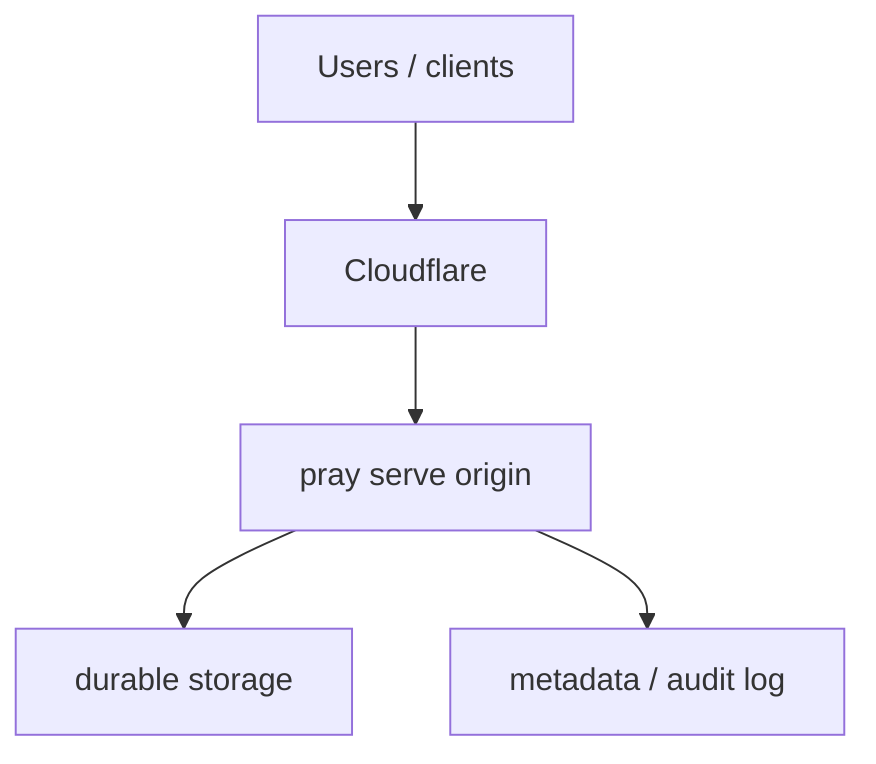

# Cloudflare deployment

Cloudflare is best used as a front door in front of a real backend.

## Recommended shape

- keep `pray serve` on Heroku, Fly.io, Hetzner, or another origin
- put Cloudflare in front for DNS, TLS, WAF, rate limiting, caching, or Cloudflare Access
- expose only read-only traffic publicly if possible
- keep publish and moderation endpoints behind stronger auth

## Typical architecture

## Practical notes

- Cloudflare Workers alone is usually not a great fit for a mutable distribution point
- `pray serve` may need durable storage, uploads, append-only audit logs, and package publishing
- Cloudflare Access is a good fit for protecting admin or publisher routes
- CDN caching can help with package downloads if your origin supports cacheable responses

## When Cloudflare is a good fit

- you already have an origin server
- you want edge TLS and WAF
- you want to protect admin or publish endpoints
- you want to cache read-only package downloads