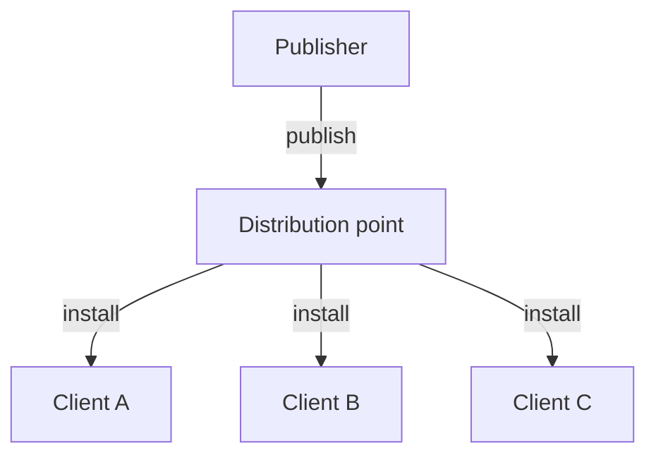
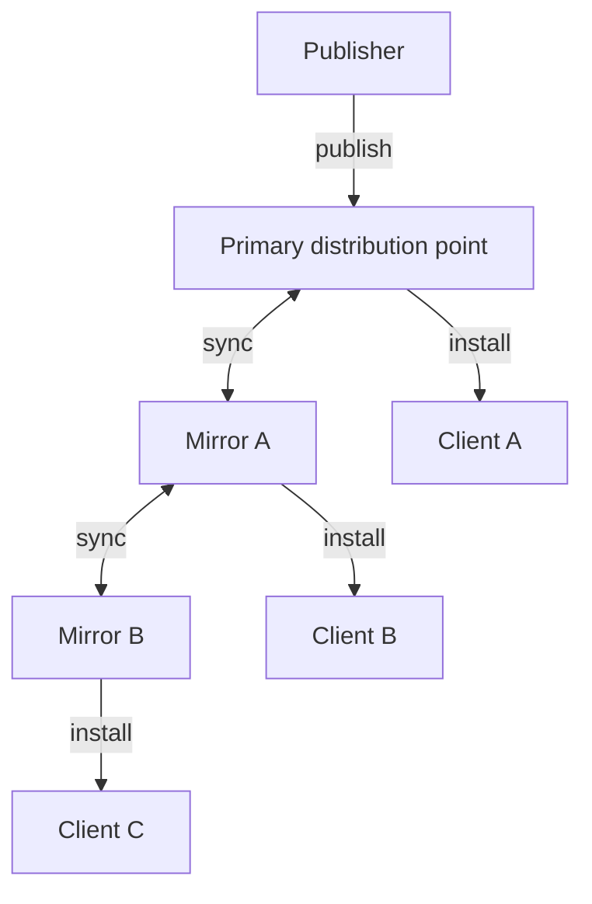
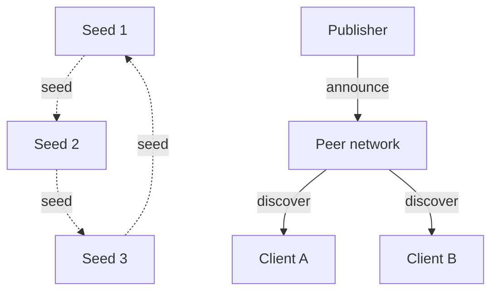
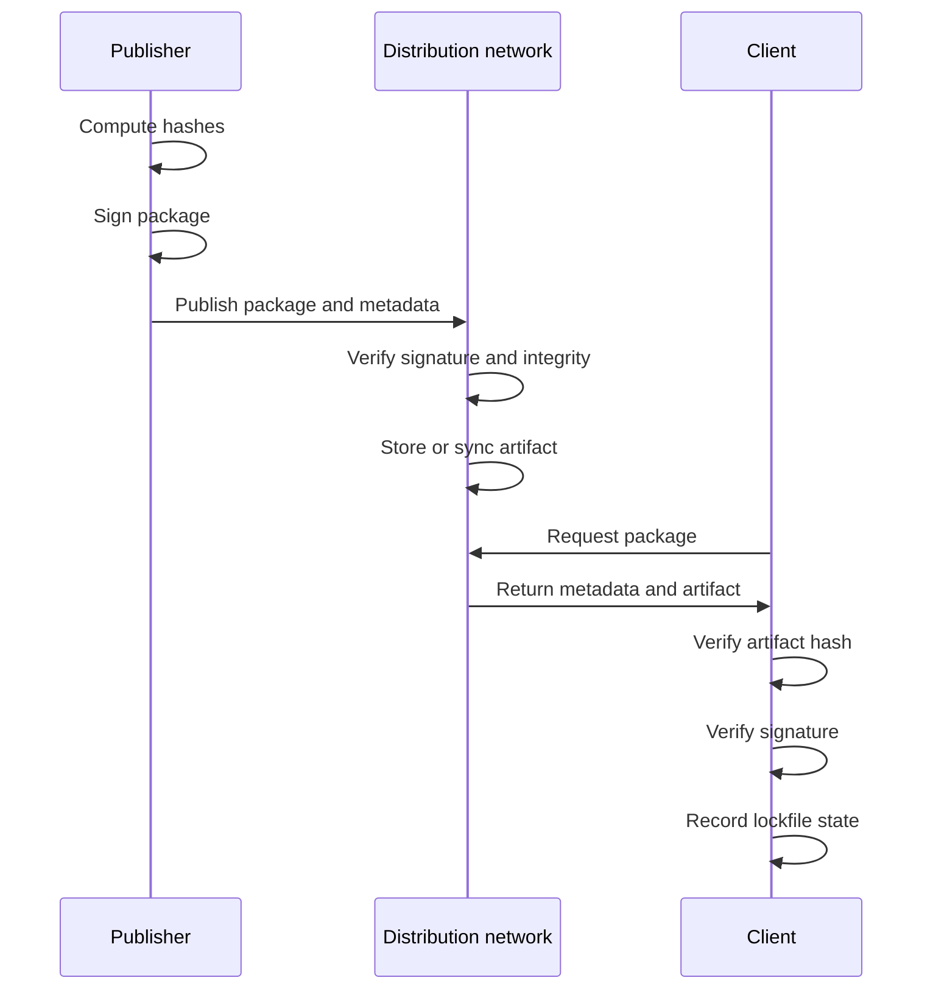

# Distribution architecture

This note compares the supported ways to move pre-inference input packages while keeping install, verify, and sync behavior deterministic.

## 1. Centralized distribution

A single distribution point publishes packages and serves clients.

**Characteristics:**
- simplest operational model
- one source of truth for package metadata and archives
- easiest client behavior to reason about
- single point of failure unless mirrored

## 2. Federated mirrors

Multiple distribution points sync with explicit peers.

**Characteristics:**
- explicit peer relationships
- eventual consistency through sync
- clients still query one server at a time
- provenance and signature checks remain required at every hop
- mirrors can improve availability without changing client workflow

## 3. Peer-distributed transport

Peers may also share artifacts directly for discovery and resilience.

**Characteristics:**
- no single server required for artifact availability
- discovery may be slower than direct HTTP lookup
- integrity checks must stay the same as centralized delivery
- useful when availability matters more than a single authoritative endpoint

## Shared verification flow

All models preserve the same verification chain:

## Practical guidance

- keep publish high trust
- keep install deterministic
- keep sync transparent to clients
- keep provenance visible in the lockfile
- prefer the simplest transport that satisfies availability and verification requirements
