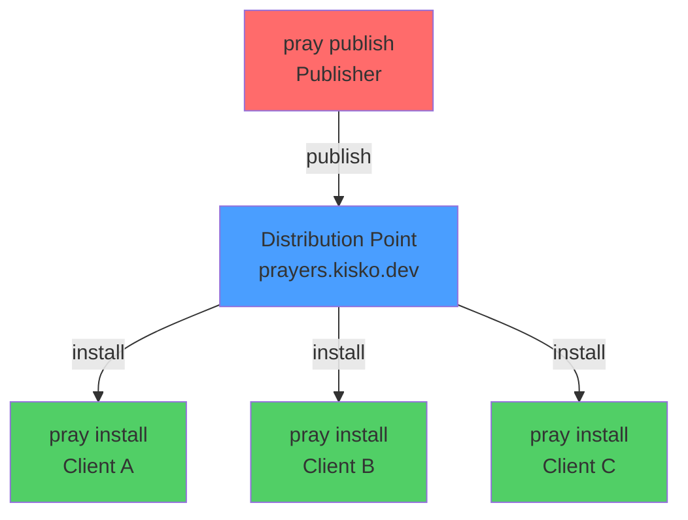
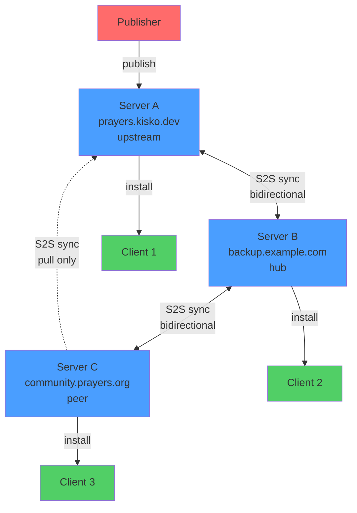
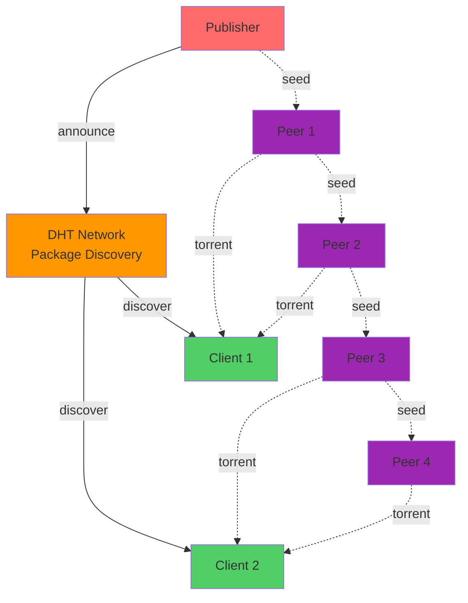
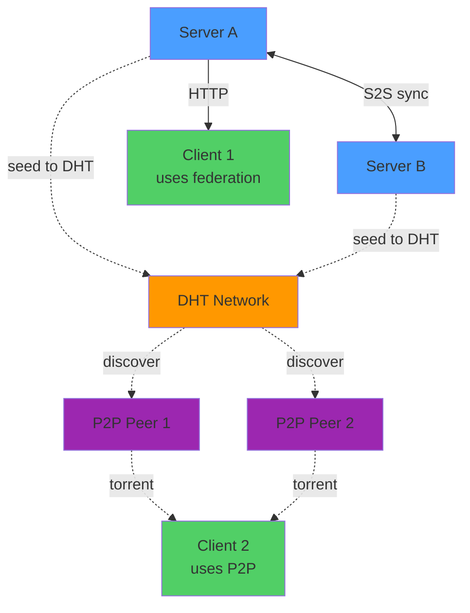
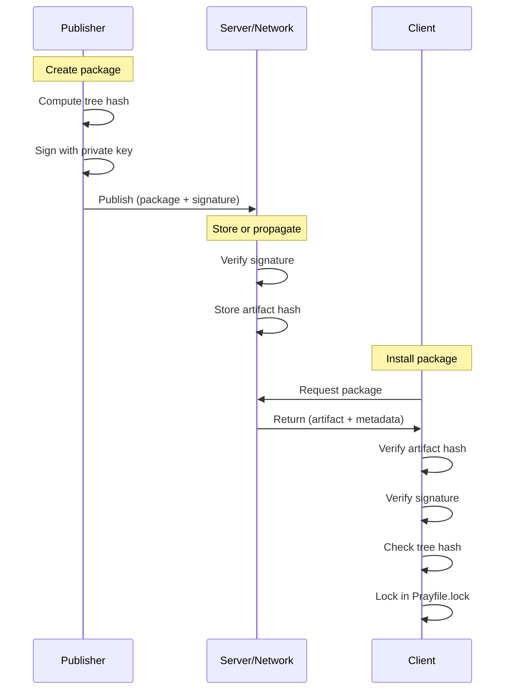

# Pray Distribution Architecture: Federation and P2P

Visual guide to the different distribution models supported by Pray.

## 1. Centralized (Current)



**Characteristics:**
- Single source of truth
- Simple to operate
- Single point of failure
- Requires trust in one operator

## 2. Federation (New Design)



**Characteristics:**
- Explicit peer relationships
- Eventual consistency through sync
- Each server validates packages
- Clients query one server
- Federation transparent to clients
- Resilient to single server failure

**Lessons from XMPP:**
- DNS SRV records can enable automatic peer discovery
- STARTTLS for transport security between servers
- Dialback or SASL for server authentication
- Stanza routing is well-defined in RFC 6120
- XML is verbose; JSON is simpler for static metadata
- Federation scales: millions of XMPP servers federate successfully

## 3. Peer-to-peer (Future)



**Characteristics:**
- No central server required
- DHT for discovery
- Torrent-style artifact distribution
- Self-organizing swarms
- Highly resilient
- Slower initial discovery

## 4. Hybrid: Federation + P2P



**Characteristics:**
- Best of both worlds
- Federation for reliability
- P2P for scale and resilience
- Clients choose their transport
- Servers can seed to DHT
- Maximum flexibility

## Trust and Verification Flow

All distribution models preserve the same verification chain:



**Security guarantees maintained across all models:**
- Artifact hash verification
- Signature checking
- Tree hash validation
- Provenance tracking
- Lockfile records

## Configuration Examples

### Centralized

```ruby
# Prayfile
source "default", "https://prayers.kisko.dev"

agent "sample/base", "~> 1.4"
```

### Federation (server side)

```toml
# prayers.toml
[server]
host = "0.0.0.0"
port = 7429

[federation]
enabled = true
sync_interval = "1h"

[[federation.peers]]
name = "upstream"
url = "https://prayers.kisko.dev"
trust = "full"
direction = "pull"
```

### Federation (client side)

```ruby
# Prayfile - client doesn't know about federation
source "default", "https://backup.example.com"

agent "sample/base", "~> 1.4"
```

### P2P (future)

```ruby
# Prayfile - client opts into P2P
source "dht", "pray+dht://bootstrap.prayers.network"

agent "sample/base", "~> 1.4"
```

## Comparison Matrix

| Feature | Centralized | Federation | P2P | Hybrid |
|---------|-------------|------------|-----|--------|
| Setup complexity | Low | Medium | Medium | High |
| Operational cost | Medium | High | Low | Medium |
| Resilience | Low | High | Very High | Very High |
| Discovery speed | Fast | Fast | Slow | Fast |
| Bandwidth efficiency | Medium | Medium | High | High |
| Trust model | Single point | Explicit peers | Cryptographic | Both |
| Privacy | Low | Medium | High | Configurable |
| Suitable for | Public/private | Teams, orgs | Public | All |

## XMPP Federation Comparison

**What Pray borrows from XMPP:**
- Server-to-server federation with explicit trust
- Optional DNS-based peer discovery (SRV records)
- Transport security (TLS between servers)
- Authentication mechanisms (can use SASL, mTLS, or API keys)
- Well-defined routing and delivery semantics
- Proven scalability (millions of federated servers)

**What Pray does differently:**
- **JSON instead of XML**: Simpler parsing, smaller payloads, better tooling
- **Static content**: Packages don't change post-publish (unlike dynamic XMPP messages)
- **Pull-based sync**: Servers pull updates periodically (XMPP pushes stanzas in real-time)
- **Content-addressed**: Packages identified by hash, not mutable names
- **Eventual consistency**: Sync happens on schedule, not immediately
- **No presence**: Servers don't maintain session state for peers

**Why not use XMPP directly:**
- XML overhead unnecessary for static package metadata
- Real-time routing complexity not needed for eventual sync
- Package distribution has different trust model than messaging
- Simpler HTTP/REST APIs easier to implement and debug
- XMPP's strengths (real-time, presence, complex routing) don't apply here

**XMPP RFCs for reference:**
- RFC 6120: XMPP Core (server-to-server federation, TLS, SASL)
- RFC 6121: XMPP Instant Messaging (routing, presence)
- RFC 7590: Use of TLS in XMPP (security considerations)

## Implementation Status

- ✅ **Centralized**: Implemented (`pray serve`)
- 🚧 **Federation**: Design complete, implementation planned
- 📋 **P2P**: Design documented, implementation future
- 📋 **Hybrid**: Depends on Federation + P2P

## References

- `SPEC.md` Section 29: Static registry protocol
- `SPEC.md` Section 29.1: Peer-to-peer distribution transport
- `SPEC.md` Section 29.2: Server-to-server federation
- `README.md`: Distribution points
- Issue: `docs/issues/20260626193000_server_to_server_federation_protocol.md`
- Issue: `docs/issues/20260626183000_torrent_seeding_and_collective_dht_distribution.md`
- Issue: `docs/issues/20260626194500_xmpp_dns_discovery_for_federation.md`
- Summary: `docs/p2p-s2s-summary.md`
